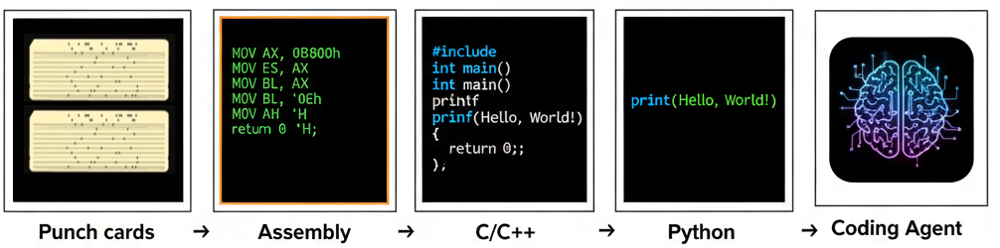
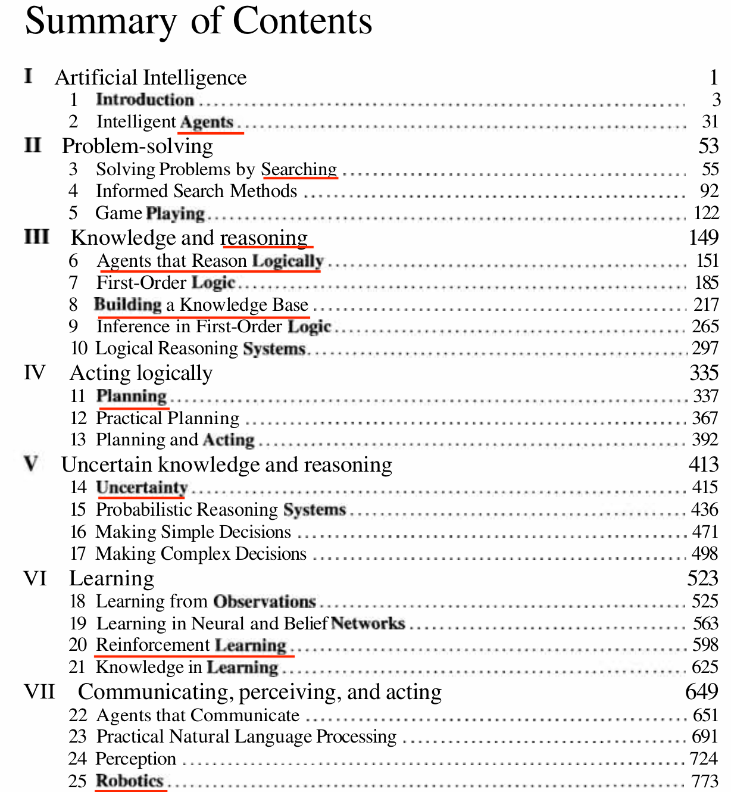
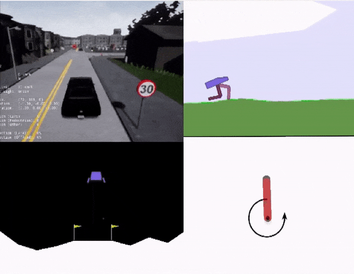

<!-- _class: title -->


# Age of Gen AI ✨

**Evolution, Capabilities, and Future Trends**

**Jit Ray Chowdhury**
2025


https://www.jitrc.com/age_of_gen_ai/

---

## Table of Contents

- **Part 1:** Foundation
- **Part 2:** Historical Context & Key Concepts
- **Part 3:** Technical Deep Dive
- **Part 4:** Current State & Future Trends

---

<!-- _class: divider -->

# Part 1: Foundation

---

## GenAI Capabilities


**Text/Code Generation:**
- Code completion and generation (Cursor, Claude Code)
- Document creation and summarization (Gemini, ChatGPT)

**Image/Video Generation:**
- Text-to-image and image editing (DALL-E, Midjourney, Nano Banana, Qwen-Image)
- Video synthesis from prompts (Sora, Veo)

**Actions/Tool/API Calls:**
- Tool use and reasoning capabilities
- API integration for real-world actions


---

## What Makes GenAI Different?

**Model Scale:** 
Billions to trillions of parameters

**Foundation Models:** 
Pre-trained on vast datasets, adaptable to multiple tasks

**Multimodal Capabilities:** 
Processing and generating text, images, audio, video

**Natural Interfaces:** 
Conversational interaction using everyday language

**Generation vs. Recognition:** 
Creating new content rather than classifying.
Open-vocabulary image detection and any-text-to-image generation


---

## Foundation Models vs. Pre-trained Models

**Traditional Pre-trained Models (2010s):**
- **Scale:** ImageNet (1000 categories), COCO - dataset for vision, millions of images
- **Adaptation:** Supervised learning, required extensive fine-tuning per task
- **Capability:** Separate models per application, Expensive new labeled datasets per task

**Foundation Models (2020s):**
- **Scale:** Internet-scale training (trillions of tokens), self-supervised (learning from input itself without labels)
- **Adaptation:** prompting, zero/few-shot learning, universal multi-task
- **Capability:** Text, images, audio, code, actions, Emergent Reasoning


---

## AI Evolution: From Narrow to Broad Capabilities


**AI (1950s):** Mimic human intelligence
- Hand-written code/algorithms by domain experts
- Example: Logical reasoning and Rule-based systems for path planning 

**ML (1980s):** Learning trends from historical data
- Hand-crafted features per domain/application
- Function fitting on features (SVMs, Decision Trees/Random Forest in Kinect)

**DL (2010s):** Learning features directly from data
- Same architecture with automatic feature extraction (CNN, RNN)
- Different trained weights per task, with large datasets

**GenAI (2020s):** Large foundation models
- Same trained model for zero-shot application across tasks


---

## Control, Interpretability, and the Intelligence Trade-off

> **Key Insight:** As we embrace higher levels of intelligence and autonomy, we must also accept reduced control and interpretability. You can't expect a rule-based algorithm to work well on unstructured data, nor expect a smart model to always follow the same rules without creativity.

**The Evolution: Trading Control for Capability:**
- **Traditional AI (1950s):** Deterministic, provable, fully introspectable
- **ML (1980s):** Data-driven decision making from extracted features
- **Deep Learning (2010s):** "Black box" models, limited explainability
- **GenAI (2020s):** Handles ambiguity and unstructured data, but hallucinates

**Organizational Hierarchy Analogy:**
- **Entry Level:** Strict rules, clear instructions (high control)
- **Middle Management:** Independent problem-solving (moderate control)
- **Executive Leadership:** High autonomy, strategic decision-making (low control, high trust)

---

## Control, Interpretability, and the Intelligence Trade-off, contd

**Probabilistic Robotics:** Embraces uncertainty in sensing and actuation for robust behavior in unpredictable environments

**Programming Language Analogy:**
- More control over optimization in Assembly/C/C++ than Python
- GenAI (prompt engineering) intuitive and accessible natural language, less control, more capable




---


## A Personal Journey: Early Insights


**2000 Automate everything**
*I am lazy, can't stand inefficiency*

**2005 Operate at speed of thought**
*Software accelerates tasks... but still takes long to build*

**2008 Make Robots**
*Need robots for real-world problems*

**2011 Common sense for robots**
*How to collect and structure all human knowledge?*

**2013 Dynamic compute allocation**
*Can't process all sensors in detail; compromises needed*

**2014 No fixed interfaces**
*Adaptive control, transfer learning between devices*


---

## How GenAI Addressed These Challenges

```
2000  ✗  Automate everything
         Progress with AI assistants, but not fully achieved

2005  ✗  Operate at speed of thought
         Coding agents helping, but not perfect yet

2008  ✗  Make Robots
         Self-driving is reality, but not general home robots

━━━━━━━━━━━━━━━━━━━━━━━━━━━━━━━━━━━━━━━━━━━━━━━━━━━━━━━━━━━━━━━━━━━━━━━━━━

2011  ✓  Common sense for robots
         ImageNet: First common sense database
         Internet-scale text training with next-word prediction

2013  ✓  Dynamic compute allocation
         Attention mechanisms, MoE, Chain of Thought

2014  ✓  No fixed interfaces
         Foundation models, zero-shot learning, prompt engineering, RAG
```

---


<!-- _class: divider -->

# Part 2: Historical Context & Key Concepts

---

## Types of Learning in AI


**Supervised Learning:**
- Uses labeled data for training, historically most successful approach
- Examples: Image classification, speech recognition

**Unsupervised Learning:**
- No labels required, leverages larger datasets
- Pattern discovery (clustering, dimensionality reduction)

**Reinforcement Learning:**
- Trial-and-error learning with reward feedback
- Some believe path to AGI, others cite sample inefficiency

**Self-Supervised Learning:**
- Best of Supervised and Unsupervised
- Learn with pseudo-labels but at large scale
- **Critical for foundation models like GPT, CLIP, DinoV3**

---

## Which Year ?
 


---

## Artificial Intelligence A Modern Approach (1995)

The authoritative, most-used AI textbook, adopted by over 1500 schools, by Stuart Russell and Peter Norvig


AI Agent, Reasoning, Planning, Reinforcement Learning, are all old concepts.

<span class="source">Refer: https://aima.cs.berkeley.edu/</span>

---

## Classical AI Concepts: Making a Comeback

**Why Classical Methods Failed Initially:**
- **RL:** Sample inefficient, lacked common sense
- **Agent-Based Systems:** Brittle, domain-specific rules
- **Search Algorithms:** Limited to well-defined state spaces

**Why They Work Now with LLMs:** LLMs provide common sense reasoning and world knowledge

**Modern Success Examples:**
- **Planning:** LLMs decompose complex goals into sub-tasks
- **Search:** Semantic search using embeddings
- **RL:** Language feedback instead of sparse numerical rewards

---

## The CNN Era (2012-2017)

- **2012 BREAKTHROUGH:** AlexNet won ImageNet, deep learning revolution begins
- **Strong inductive bias:** Convolution perfectly suited for image structure
- **Everything-to-image:** Audio spectrograms, road networks as layers
- **Key datasets:** ImageNet, COCO
- **Architecture evolution:** ResNet, wider networks, pyramids
- **Current status:** Superseded by Vision Transformers (ViT, DINOv3)


---

## Everything as image, till transformers


<span class="source">source: [ChauffeurNet](https://arxiv.org/abs/1812.03079v1), [Wayformer](https://arxiv.org/abs/2207.05844)</span>

---

## Scale drove Deep Learning Process (Andrew Ng 2016)
But scale requirement grows exponentinally, labeled data is expensive
<!-- _class: centered-content -->

<span class="source">[deeplearning.ai](https://cs230.stanford.edu/files/C1M1.pdf) | [Youtube](https://www.youtube.com/watch?v=LcfLo7YP8O4)</span>

---

## CNNs can't understand, the reason behind the laughter

<!-- _class: centered-content -->


---

## RL Excitement and Difficulty


- **Early promise:** Deep RL on Atari games, AlphaGo breakthrough
- **Persistent challenges:** Reward hacking, sparse reward signals
- **Sample inefficiency:** Millions of interactions needed for simple tasks
- **LIMITATION:** Worked well in constrained environments, struggled in open worlds
- **Example:** CoastRunners boat racing - agent farms powerups in circles instead of finishing race

---

## Deep RL for AGI Ambitions (2016 Peak)

**Key players:** DeepMind (AlphaGo), OpenAI (Dota 2, robotics)

**Major projects:**
- AlphaGo defeats Lee Sedol (2016)
- Atari game suite benchmarks
- OpenAI Gym standardized environments

**This period saw peak optimism for RL as path to AGI**




---
**DeepMind Breakout on the Atari in 2015, AlphaGo in 2016**


<span class="source">source: [Human-level control through deep reinforcement learning](https://research.google/blog/from-pixels-to-actions-human-level-control-through-deep-reinforcement-learning/),
 [BBC News](https://www.bbc.com/news/technology-35785875)
</span>


---

## Yann LeCun's Cake Analogy 2016


**Information Content During Learning:**

**Reinforcement Learning (the cherry - 1%):**
- Scalar reward signal given intermittently
- **Few bits per sample**

**Supervised Learning (the icing - 10%):**
- Category or numerical predictions for each input
- **10 to 10,000 bits per sample**

**Self-Supervised Learning (the cake - 89%):**
- **KEY INSIGHT:** Predicts any part of input from any observed part
- Future frame prediction, masked language modeling
- **Millions of bits per sample**


---

## The Bitter Lesson: Advice for AI Developers

**(From Rich Sutton's Essay, 2019)**

**Bet on Scaling, Not on Human Knowledge**
- General methods leveraging computation are most effective
- The real world is endlessly complex; build meta-methods that discover complexity

> *"The biggest lesson from 70 years of AI research is that general methods that leverage computation are ultimately the most effective, and by a large margin."*

**Embrace General-Purpose Methods: Search and Learning**
- Search and Learning are the only approaches that scale with computation
- History shows they outperform systems designed with human expertise

> *"We have to learn the bitter lesson that building in how we think we think does not work in the long run."*

---

## The Bitter Lesson: Proof in Practice

**Computer Chess (Deep Blue, 1997)**
- Brute-force search (200M positions/second) defeated Kasparov
- Hand-coded strategies proved inferior to computational search

**Computer Go (AlphaGo, 2016)**
- Deep learning + self-play discovered superior strategies
- Human intuition surpassed by computation

**Natural Language Processing (GPT-3)**
- Statistical models replaced hand-coded grammar rules
- Achieved nuanced human-like communication through scale

**Computer Vision (DINOv3, 2025)**
- Self-supervised learning surpassed supervised methods
- No hand-designed features required


---


<!-- _class: divider -->

# Part 3: Technical Deep Dive

---

## Transformers Changed Everything (2017)

**SEMINAL PAPER:** "Attention Is All You Need" - Vaswani et al., Google, 2017

- **Self-attention mechanism:** Every position attends to all other positions directly.
   - Constant Path Length
   - Mitigated vanishing gradients 

- **Eliminated recurrence/Faster Training:** No sequential dependencies = full parallelization, GPUs could process entire sequences simultaneously

- **Foundation for multimodality:** Token-based design (later) generalized beyond text


---

## GPT Emerges, RL Winter Begins (2019)

**RL Criticism Peak - "Deep RL is a waste of time" (2019):**
- Still sample-inefficient despite years of research
- Limited to toy problems and constrained action spaces
- No common sense reasoning, excessive exploration

**GPT-1/GPT-2 Breakthrough:**
- **KEY INSIGHT:** Next-token prediction showed emergent intelligence
- Initially limited to text completion and basic coding
- **SURPRISE:** Scaling simple objective yielded complex behaviors

---

## How ChatGPT is Better than GPT

- Supervised Fine-Tuning (SFT) with RLHF
- Also called: instruction tuned, human alignment, preference optimization
- Basically tuned for humans to like it and communicate easily
- Without this, GPT was like a human expert with knowledge but poor social skills


---

## RL wasn't a waste—it needed the foundation model "cake" first (2024-2025)

**Why RL Works Now (vs. 2019 criticism):**
- **Foundation models provide common sense:** LLMs solve the "cold start" problem
- **Verifiable environments:** Code execution, math proofs enable RLVR

**Modern Success Stories:**
- **OpenAI o1:** Extended thinking time via RL, 83% → 94% on AIME with more compute
- **DeepSeek R1:** Open-source reasoning model matching o1 performance
- **Code generation:** RL improves debugging, test-driven refinement


---

<!-- _class: divider -->

# Part 4: Current State & Future Trends

---

## Current GenAI Trends (2025)

**Core Capabilities:**
- **Conversational AI:** Real-time voice interactions with reasoning (Gemini Live, GPT-4o Voice)
- **Multi-modal AI:** Unified processing of text, images, audio, and video
- **Coding Agents:** AI pair programmers with autonomous debugging (Cursor, Claude Code, Copilot)
- **Specialized AI Agents:** Domain-specific assistants with tool use and memory
- **Hyper-Personalization:** Tailored experiences

**Transforming Industries:**
- **SaaS:** AI-first applications, generative UI, embedded copilots
- **Healthcare:** Diagnostic assistance, drug discovery, personalized treatment plans
- **Workplace:** Automated workflows, AI-powered productivity tools, "Service as Software"

---

## AI Evolution Stages


**Perception AI (2012 AlexNet) - MATURE**
- Speech Recognition, Object Detection, Medical Imaging
- **Status:** Production-ready, widely deployed

**Generative AI (2020s) - MAINSTREAM**
- Digital Marketing, Content Creation, Image/Video Generation
- **Status:** Rapid adoption, improving quality

**Agentic AI (Current) - EMERGING**
- Coding Assistant, Customer Service, Patient Care
- **Status:** Early deployment, variable reliability, human oversight required

**Physical AI (Next) - EARLY RESEARCH**
- Self-Driving Cars (L4/L5 in limited areas), General Robotics
- **Status:** Experimental, safety testing, limited deployment

---

## LLM-powered Autonomous Agent Systems


> **Systems Thinking:** LLM models are like powerful engines; you need systems like airplanes, cars, or factories to take advantage of them and produce value.

**Components:**
- **Foundation model:** Intelligence/reasoning engine
- **Tools:** Calculator, code interpreter, web search, APIs
- **Planning:** Chain-of-thought, self-reflection, subgoal decomposition
- **Memory:** Short-term context + long-term storage
- **Action execution:** Real-world task completion

**Applications:** Customer service, business optimization, code generation, research, personal assistants

---

## Next Challenges

**World Model:**
- **Problem:** Next-token prediction insufficient for 3D spatial reasoning, needs understanding of physics
- **Data gap:** Scarcity of "boring" everyday activity data, limited 3D spatial data
- **Efforts:** GAIA-1 (Wayve), Sora's physics understanding, Genie 3, World Labs

**Persistent Memory:**
- **Problem:** Don't want AI "acting like it's their first day every day"
- **What to store:** Importance, recency, relevance (forgetting curve)
- **How to store:** Knowledge graphs, temporal sequences, hierarchical memory

**Continuous Learning:**
- **Need:** Models with "muscle memory" and continuous learning
- **Challenge:** Catastrophic forgetting vs. learning from mistakes
- **Analogy:** "Sleeping over it" effect for consolidation

---

## ML and DL Jagged Performance


<span class="source">source: [HOGgles: Visualizing Object Detection Features](https://people.csail.mit.edu/torralba/publications/ihog_iccv.pdf), [NDTV](https://www.ndtv.com/offbeat/watch-tesla-autopilot-feature-mistakes-moon-for-yellow-traffic-light-2495804)</span>

---

## Risks and Responsible Development

**Demonstrated Capabilities and Risks:**
- **FACT:** LLM-generated content passes Turing tests, enabling misinformation
- **Evolution:** Sandboxed → read-only internet → agentic write capabilities

**Current Risk Acceleration:**
- **CONCERN:** Agentic deployment without adequate guardrails
- **Vision-Language-Action (VLA) models:** Extending AI to physical robots
- **HISTORICAL PARALLEL:** Autonomous vehicles required extensive testing

**Accessibility vs. Safety Trade-off:**
- **RISK:** Easy deployment without training expertise
- No accountability frameworks for widespread AI deployment
- **RECOMMENDATION:** Careful evaluation before factory and home deployment


---


----

## Summary

- **Scale through efficiency, not just resources:** Raw compute and data are expensive; algorithmic and architectural improvements achieve scale with same resources
    - Efficient models, smarter learning methods, better search algorithms, effective context management
    - Effeciency often the key enabler for scaling

- **Natural language as universal interface:** LLMs are foundational technologies—comparable to fire and the internet—democratizing access to intelligence
    - AI Agents with tool use, memory, and planning are transforming everything

- **The intelligence trade-off:** More capability and autonomy requires accepting less control and interpretability
    - We will learn to trust intelligent systems more 

- **Next frontiers:** World models, persistent memory, and continuous learning
    - Spatial reasoning, physics understanding, learning from experience without forgetting

- **Responsible deployment:** Robust guardrails and evaluation frameworks needed before autonomous operation at scale

---

<!-- _class: title -->

# Thank You

**Questions?**

Jit Ray Chowdhury
2025

https://www.jitrc.com/age_of_gen_ai/

----

## References

**Additional Resources:**
- [NVIDIA - Generative Physical AI](https://www.nvidia.com/en-us/glossary/generative-physical-ai/)
- [Understanding Generative AI in Layman's Terms](https://pub.aimind.so/understanding-generative-ai-in-laymans-term-46e8d088659a)
- [IBM - History of AI](https://www.ibm.com/think/topics/artificial-intelligence)

---

## References: The Bitter Lesson

1. [The Bitter Lesson by Rich Sutton (PDF)](https://www.cs.utexas.edu/~eunsol/courses/data/bitter_lesson.pdf)
2. [Medium - The Bitter Lesson](https://medium.com/towards-nesy/the-bitter-lesson-1a1d282ae1b9)
3. [arXiv - The Bitter Lesson of Scaling](https://arxiv.org/abs/2410.09649v1)
4. [Cognitive Medium - The Bitter Lesson](https://cognitivemedium.com/bitter-lesson)
5. [Xander.ai - Robotics and The Bitter Lesson](https://xander.ai/robotics-and-the-bitter-lesson)
6. [Exxact Corp - Revisiting Sutton's Bitter Lesson](https://www.exxactcorp.com/blog/Deep-Learning/compute-goes-brrr-revisiting-sutton-s-bitter-lesson-for-artificial-intelligence)
7. [Hacker News Discussion 1](https://news.ycombinator.com/item?id=42672790)
8. [Hacker News Discussion 2](https://news.ycombinator.com/item?id=40134071)
9. [Reddit - The Bitter Lesson 2.0](https://www.reddit.com/r/MachineLearning/comments/10ag9id/d_bitter_lesson_20/)

---

## References: Self-Supervised Learning & RL

**Yann LeCun's Cake Analogy:**
- [SyncedReview - Yann LeCun's Cake Analogy 2.0](https://medium.com/syncedreview/yann-lecun-cake-analogy-2-0-a361da560dae)
- [YouTube - Yann LeCun on Self-Supervised Learning](https://www.youtube.com/watch?v=OuntI2Y4qxQo)

**"Deep Reinforcement Learning is a waste of time" (2019):**
- [Jtoy.net Blog](http://www.jtoy.net/blog/deep-reinforcement-learning-is-a-waste-of-time.html)
- [Hacker News Discussion 1](https://news.ycombinator.com/item?id=27794248)
- [Hacker News Discussion 2](https://news.ycombinator.com/item?id=27868539)
- [Medium - Why RL Became Uncool](https://machine-learning-made-simple.medium.com/why-reinforcement-learning-became-uncool-and-how-it-might-come-back-7e791efbac24)
- [Plain English - RL is Dead, Long Live the Transformer](https://plainenglish.io/blog/reinforcement-learning-is-dead-long-live-the-transformer)

**RL Renaissance:**
- [Medium - RL Isn't Dead, It's Evolving](https://medium.com/illumination/reinforcement-learning-isnt-dead-it-s-evolving-f8702b101f9e)

---

<!-- _class: divider -->

# Appendix

---

## A1: Challenges of Reinforcement Learning (RL)

**Difficulty of Reward Specification:**
- Designing effective reward functions without incentivizing unintended behavior (reward hacking)
- Hard to specify "good" outcomes precisely and comprehensively for complex tasks

**Sample Inefficiency:**
- Requires vast number of environment interactions to learn optimal policies
- Expensive, time-consuming, or dangerous in real-world applications (robotics, autonomous driving)

**Limited State and Action Spaces:**
- Historically successful only in constrained environments (board games, simple control systems)
- Real-world problems involve high-dimensional, continuous spaces making exploration extremely challenging

**Need for Common Sense and Guided Exploration:**
- Early RL struggled without prior knowledge or domain-specific heuristics
- Agents would "wander aimlessly" in vast, unstructured environments without guidance

---

## A2: Unsupervised Learning: Images vs. Language

**Challenges with Images:**
- Raw pixel data lacks explicit, discoverable hierarchical structures consistent across diverse images
- Pixel meaning highly context-dependent (red pixel could be car, flower, or brick wall)
- Unsupervised models often learned noisy or uninterpretable features without human-annotated labels

**Success with Language:**
- **Sequential and Contextual Nature:** Words appear in specific order conveying meaning; context provides strong learning signals
- **Statistical Regularities:** Rich patterns in word co-occurrence and grammatical structures
- **Hierarchical Structure:** Natural progression from characters → words → phrases → sentences → paragraphs
- **Predictive Tasks:** Masked language modeling (BERT) and next-token prediction (GPT) leverage inherent language structure

---

## A3: AI Agents: Resurgence of Early Concepts

**Early AI Limitations:**
- **Complexity:** Real-world environments overwhelmed available computational power
- **Uncertainty:** Assumed perfect knowledge of environment (rarely realistic)
- **Brittleness:** Rule-based systems failed when encountering unprogrammed situations
- **Lack of Common Sense:** Missing broad, intuitive understanding of the world

**LLMs Re-enabling Classical Methods:**
- **Broad World Knowledge:** Unprecedented breadth of general knowledge and common sense from vast training data
- **Natural Language Interface:** Human-like text understanding enabling intuitive goal specification
- **Reasoning and Planning:** Emergent capabilities for breaking down complex tasks into sub-goals
- **Tool Use:** Can be augmented with external tools (APIs, search engines, code interpreters)
- **Handling Unstructured Information:** Excel at processing real-world's dominant unstructured text format

